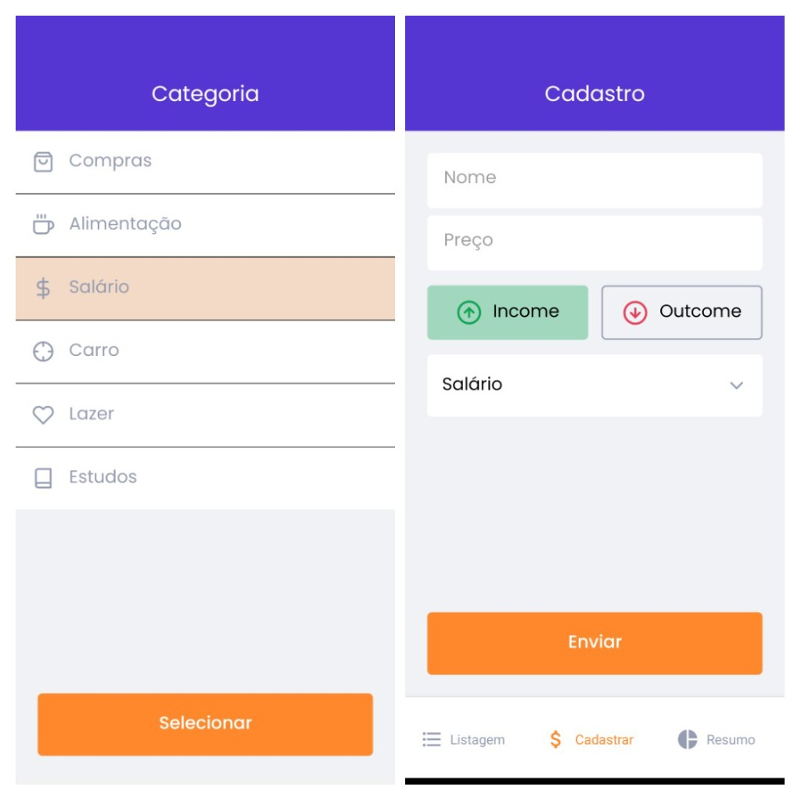

# App de gerenciamento de finanças pessoais

Desenvolvido durante o curso de React Native da RocketSeat 💜

  <a href="#Imagens">Imagens</a>&nbsp;&nbsp; | <a href="#Emular">Emular</a>

# Tecnologias 💻:

### React Native (Expo Bare Workflow)📱

- Estilização:
  - Styled Components 💅
- Navegação:
  - Bottom Tab Navigator
  - Stack Navigator
- Autenticação:
  - Google sign-in Oauth2
  - Apple sign-in
- Armazenamento:
  - AsyncStorage

# Imagens

Autenticação e Dashboard

GIFs utilização

Seleção dos tipos de entradas/saídas

Gráfico de saídas

  <a href="#Tecnologias">Início</a>

# Emular:

- Instalando dependências do projeto (dentro da pasta principal: gofinance):
  - yarn
- Instalando expo no OS (Sistema Operacional) <a href="https://docs.expo.dev/get-started/installation/">Documentação Expo</a>:

  - yarn add --global expo-cli

- expo start (dentro da pasta principal: gofinance)
